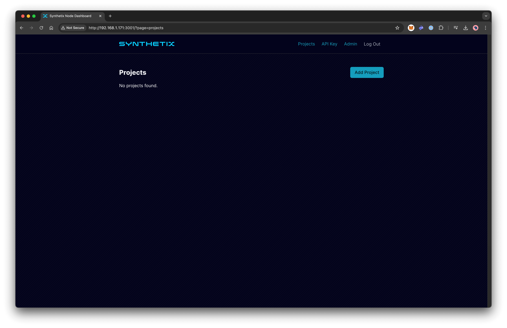
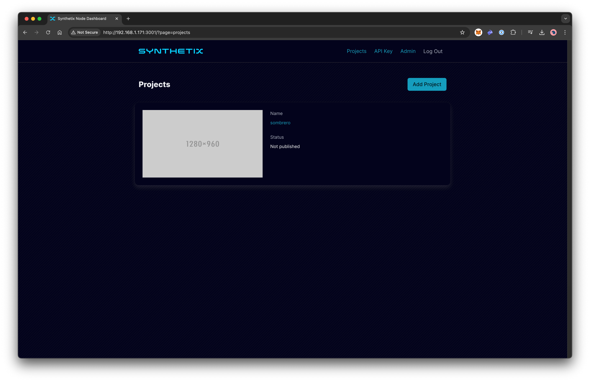
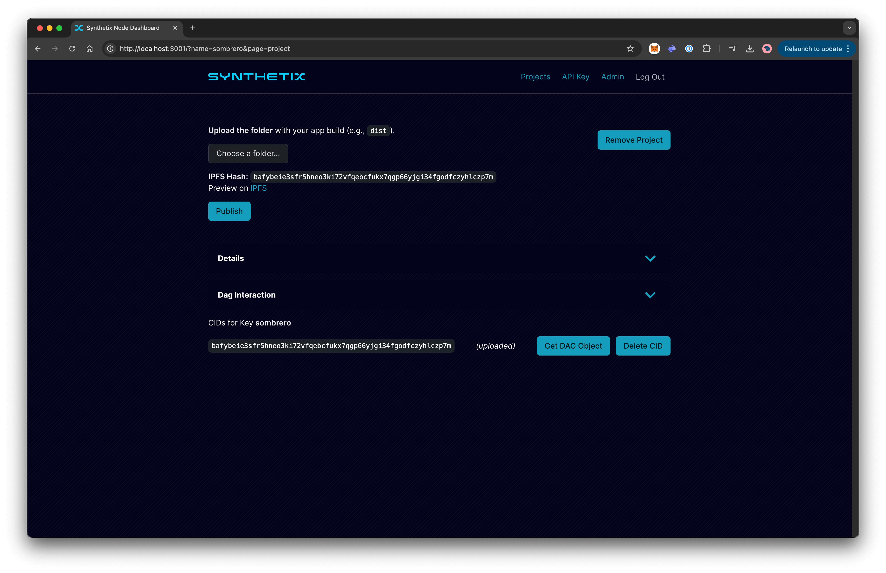

# Dashboard

## Overview
The Dashboard allows DApp developers to register, obtain authorization, and manage their apps. They can view information, publish new DApps, and update or delete them.

---

## Features

### Global Statistics

The home page displays the global statistics of the IPFS Cluster launched by the Synthetix ecosystem, as well as the number of running nodes.

---

### Wallet Authorization
To start using the application, **connect** your wallet (e.g., MetaMask, Rabby, etc.) and **sign** a message for authorization to verify ownership of your wallet.

---

### Projects

Click **Projects** to move to your DApps and **Add Project**.

---

### Add Project

Enter the name of your project. The name will automatically be checked for uniqueness. If successful, you will be prompted to **mint** an NFT in the smart contract, linking it to the project name (one NFT represents one project). A unique cryptographic **key pair** will be generated to enable content updates and project identification via **IPNS** in **IPFS**.
> **Note:** Expand the **Details** to view additional information about the processes.

Afterward, you can see the added project on the Projects page.

Clicking the **project name** navigates you to a page to **upload** and **publish**.

---

### Upload and Publish

**Upload** the folder with your app build (e.g., dist). IPFS will automatically import its contents and pin the data. Click the **Publish** button to **create** or **update** an IPNS link for your project.

> **Note:** Expand the **Details** or **Dag Interaction** to view additional information about the processes.

You can also **Remove Project** on this page.

---

### Published

Upon successful publication, the updated project will appear in the list, complete with IPFS and IPNS links for viewing and a preview screenshot.

