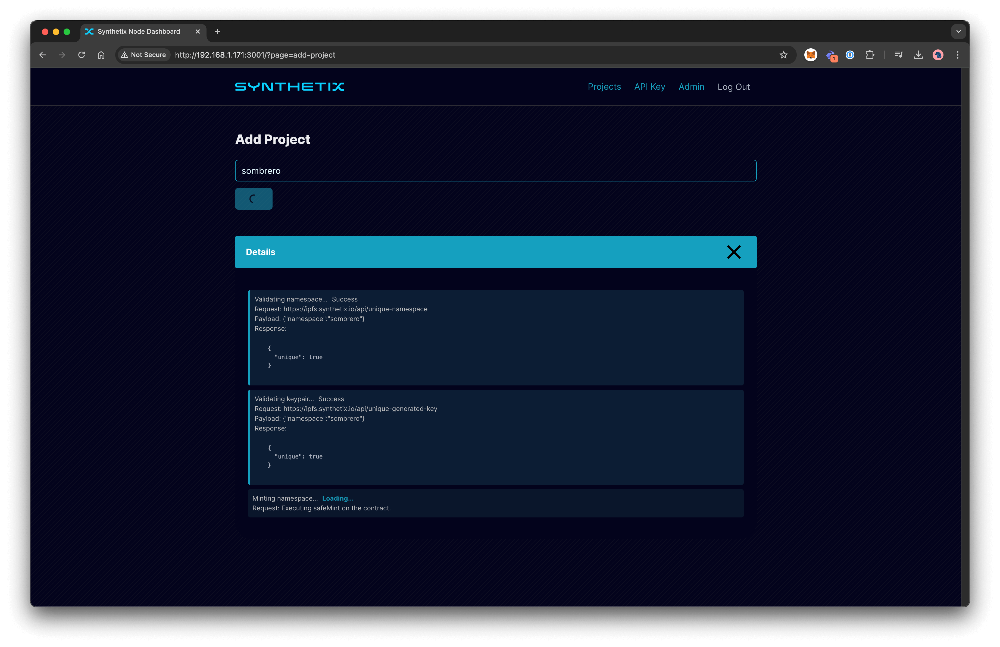
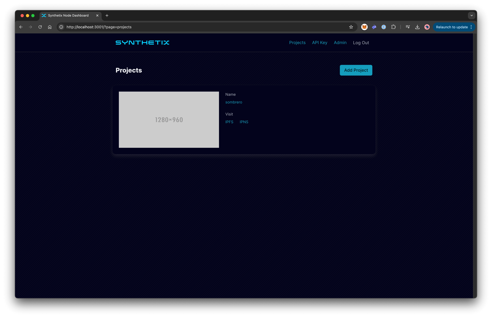

# Dashboard

## Overview
The Dashboard allows DApp developers to register, obtain authorization, and manage their apps. They can view information, publish new DApps, and update or delete them.

---

## Features

### Global Statistics

The home page displays the global statistics of the IPFS Cluster launched by the Synthetix ecosystem, as well as the number of running nodes.

---

### Wallet Authorization
To begin using the application:
1. **Connect** your wallet (e.g., MetaMask, Rabby, etc.).
2. **Sign** the provided message to confirm ownership of your wallet.

This step verifies your access and authorizes your actions.

---

### Projects Management

#### Projects Overview

1. Navigate to the **Projects** section to view, manage, or create new DApps.
2. Click **Add Project** to start a new uploading.

#### Add Project

1. Enter a unique **project name**. The system will automatically ensure the name is unique.
2. Once the name is verified:
    - You will be prompted to **mint an NFT** via the smart contract. This NFT is linked to your project name (1 NFT = 1 Project).
    - A unique **cryptographic** key pair will be created to help update and identify your project in **IPFS**.

> Click on the **Details** section to learn more about how your project is created.

After successful creation, your project will appear on the **Projects** page.

#### Project Details

Click on the project name to manage it:
- **Uploading** app builds.
- **Publishing** updates.
- **Removing** the project.

---

### Upload and Publish

#### Upload

1. **Upload** the folder containing your app build (e.g., `dist` folder).
2. IPFS will:
    - Automatically import the folder's contents.
    - Pin the data for distribution.

#### Publish
After uploading:
1. Click the **Publish** button to:
    - Create a new **IPNS link** pointing to your app's content.
    - Update the existing IPNS entry if it exists.

> **Note:** Expand the **Details** or **Dag Interaction** to view additional information about the processes.

---

### Published Projects

After successful publication:
- Your updated project will be added to the project's list.
- The entry includes:
    - **IPFS and IPNS links** for viewing.
    - A preview **screenshot**.

